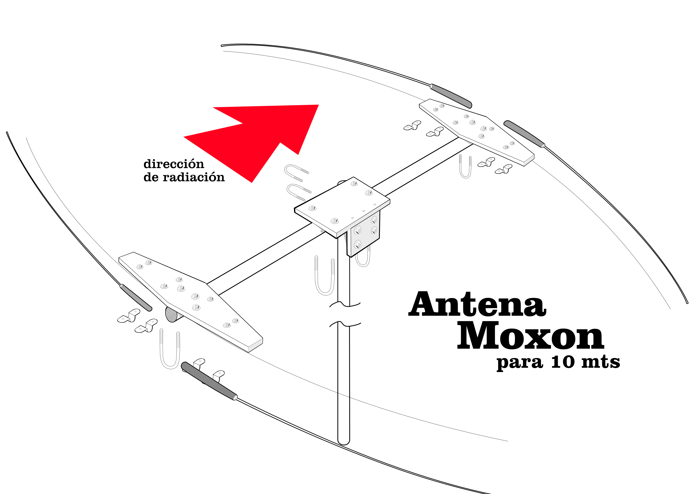
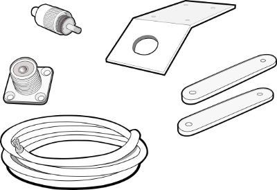
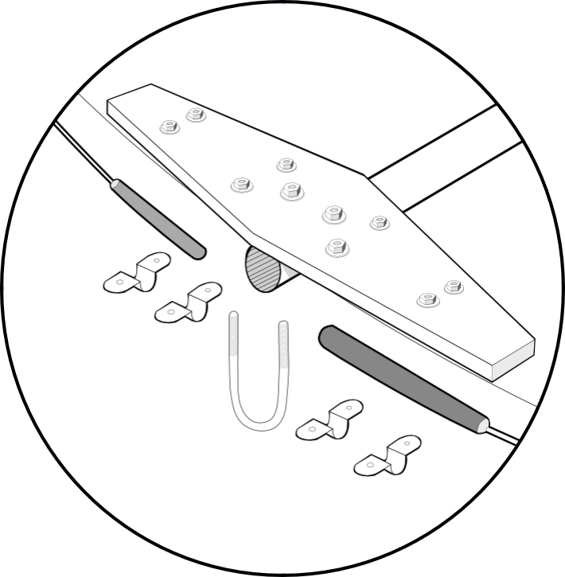
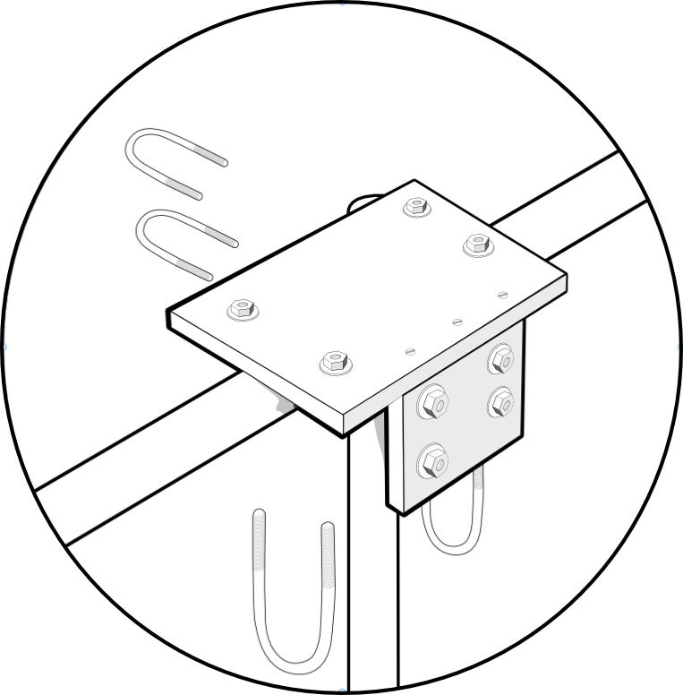

# ATREVETE-A-VOLAR-...-MOXON-ANTENA-PROYECTO-PARA-10-MTS.

Guía para construir una antena de HF para 10 metros (resonante también en 15 y 20 m), inspirada en el diseño del radioaficionado Toivo, W8TJM.

La antena Moxon es reconocida en el mundo de la radioafición por su sencillez, eficiencia y excelente rendimiento en espacios reducidos. Su diseño rectangular, con extremos doblados hacia adentro, permite obtener un patrón direccional definido y una relación frente‑espalda destacable, todo con materiales accesibles y fáciles de manipular.

El radioaficionado Toivo, W8TJM popularizó variantes prácticas y económicas de la Moxon, demostrando que con creatividad y precisión se puede lograr una antena de gran calidad sin necesidad de estructuras complejas. Esta guía toma como referencia sus aportes y los adapta a un enfoque casero, pensado para quienes disfrutan experimentar y construir con sus propias manos.

El objetivo es que, al finalizar, cuentes con una antena lista para operar en la banda de 28 MHz, optimizada para DX y contactos locales, combinando portabilidad con rendimiento.

Materiales necesarios
Conectores PL‑259

Cable de cobre de 4 mm para los elementos radiantes y el reflector (se recomienda usar colores distintos, por ejemplo rojo y azul)

4 cañas de pescar de 3 m para los brazos

Boom de madera

Separadores de unión de 10 cm entre radiantes y reflector

Abrazaderas y bridas plásticas

Piezas de madera terciada pintadas para impermeabilizar y proteger contra humedad e intemperie

Montaje
Boom y brazos

Detalles de cómo ajustar el boom a los brazos para sujetar las cañas de pescar.

Ensamblaje del centro

Detalles de cómo fijar el centro de la antena al poste (preferentemente de 6 m en aluminio).

Ajuste final

Una vez montada, es fundamental ajustar la antena con un NanoVNA para que el ROE en la frecuencia de 28 MHz quede en la porción de trabajo deseada.

Conclusión
Con esta construcción sencilla y robusta, tendrás una antena Moxon casera lista para experimentar en la banda de 10 m y explorar también 15 y 20 m. Es un proyecto ideal para radioaficionados que disfrutan del DIY y buscan rendimiento direccional con materiales accesibles.
